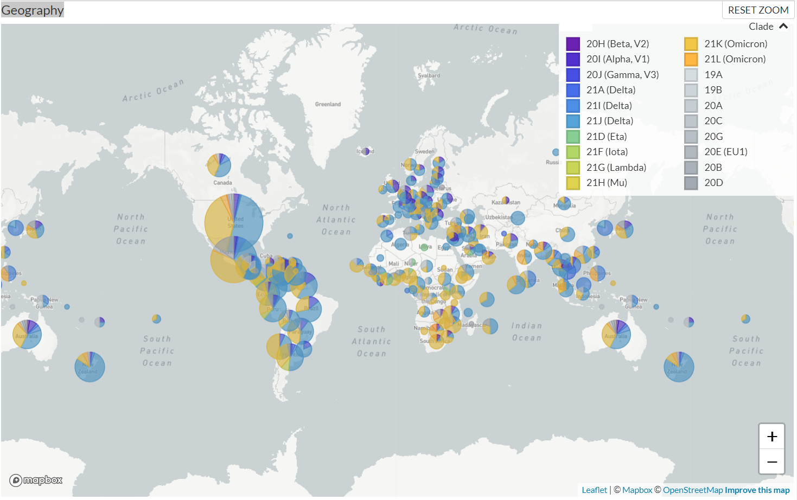

<br> Camila Turner Escalante, A01423579 <br>
Paulina Galindo Rodríguez, A01424818 <br>
Ramona Nájera Fuentes, A01423596 <br>

***

### INTRODUCCIÓN
> Situación actual del COVID-19

|  Nivel  |    Casos    |  Muertes  |
| :----:  |    :----:   |   :----:  |
| Mundial | 152,506,783 | 2,719,101 |
| México  |  5,731,635  | 324,033   |

> ¿Qué es el **coronavirus** (CoV)? 

Es una **amplia familia de virus** que pueden causar desde un resfriado común hasta enfermedades más graves. Reciben su nombre porque los picos que sobresalen de su membrana asemejan a la corona del sol. Este nuevo coronavirus, también conocido como **SARS-CoV-2**, no se había detectado antes en un ser humano previo al brote en Wuhan, China en diciembre 2019. \
Entre sus **síntomas** más comunes encontramos la **fiebre, tos, cansancio, y perdida del gusto o el olfato**. Otros síntomas menos comunes son el **dolor de garganta, dolor de cabeza, dolores y molesias, dificultad para respirar**, entre otros.

Otro concepto importante es el covid-19. Aquí cabe recalcar que el covid-19 no es los mismo que el coronavirus. Mientras que el coronavirus es el virus que causa la infección, el **covid-19 es la enfermedad causada por el virus**. Esta enfermedad afecta a las personas de diferente manera, para algunas puede ser como un resfriado y para otras puede convertirse en una enfermedad respiratoria más grave o incluso causar la muerte.

El **SARS-CoV-2 se transmite principalmente de persona a persona**, pero también se puede contagiar de los animales a los humanos. Cuando una persona inferctada tose, estornuda o habla genera **gotículas respiatorias** (pequeñas partículas de fluidos) **que viajan por el aire junto con el virus**. Dichas gotitas pueden llega a la nariz o boca de alguna persona cercana y llegar hasta los pulmones al respirar. De igual forma si el virus se encuenta sobre una supericie u objeto, al tocarlos el virus se puede quedar en las manos y si la persona se toca la nariz, boca y posiblemente los ojos con esa misma mano puede resultar infectado.

> ¿Qué es una **mutación**? 

Una mutación es un **cambio en la secuencia de ADN**. Esto es el resultado de un error al copiar dicha secuencia de ADN. Hay diferentes tipos de mutaciones, entre ellos encontramos la sustitución (cuando un nucleótido es sustituído por otro, por ejemplo, una A es cambiada por una C). Otro tipo es por incersión (cuando un nucleótido extra es añadido). También está la deleción (cuando un nucleótido es eliminado).

**Mutación del covid19.**
El virus hace copias de sí mismo mediante un proceso llamado replicación en el que las nuevas copias presentan pequeños cambios, a estos cambios se les conoce como mutaciones.
Un virus que ha sufrido una o varias mutaciones es una variante del virus original.
Algunas mutaciones pueden conllevar cambios en las características de un virus, como alteraciones en su transmisión o la gravedad.
Cuanto más circula el virus, más suceptible es de modificarse. Ocasionalmente estas modificaciones pueden dar lugar a una variante del virus que está mejor adaptada a su entorno a comparación con el virus original; a este proceso se llama evolución vírica.

***

### PROPUESTA
El objetivo principal de este proyecto es *analizar al virus SARS-Cov-2 y sus mutaciones* para obtener información al respecto. Nosotras pretendemos comparar la secuencia original de Wuhan con genomas escogidos al azar de cada continente para identificar las mutaciones que predominan en el gen S dependiendo del área geográfica. También agregaremos el filtro de las fechas para que sean variantes dentro del año 2021, es decir, de enero 01, 2021 a diciembre 31, 2021.

### HIPÓTESIS
Nuestra hipótesis es que las mutaciones que encontremos entre el genoma original de Wuhan, China y el genoma de los otros países van a cambiar dependiendo de la región en la que se encuentre el país, es decir, cierta mutación va a ser más común en un área geográfica que en otra.

***

### PROYECTO

```{r}
rm(list=ls()) # Limpiar environment
cat("\014") # Limpiar consola
```
<br>**LIBRERÍAS**
  
  1. seqinr: Biological Sequences Retrieval and Analysis <br>
  2. ggplot2: Create Elegant Data Visualisations Using the Grammar of Graphics
```{r}
#install.packages("seqinr")
#install.packages("ggplot2")

library(seqinr)
library(ggplot2)
```

<br>**PASO 1**: Declaración
```{r}
codonAamino = c(GAC="D",GAU="D", GAA="E",GAG="E", CGA="R",CGC="R",CGG="R",
                CGU="R",AGA="R",AGG="R", AAA="K",AAG="K", AAC="N",AAU="N", 
                CAC="H",CAU="H", CAA="Q",CAG="Q", UCA="S",UCC="S",UCG="S",
                UCU="S",AGC="S",AGU="S", ACA="T",ACC="T",ACG="T",ACU="T", 
                GCA="A",GCC="A",GCG="A",GCU="A", GGA="G",GGC="G",GGG="G",
                GGU="G", GUA="V",GUC="V",GUG="V",GUU="V", CCA="P",CCC="P",
                CCG="P",CCU="P", CUA="L",CUC="L",CUG="L",CUU="L",UUA="L",
                UUG="L", UUC="F",UUU="F", UAC="Y",UAU="Y", AUA="I",AUC="I",
                AUU="I", AUG="M", UGG="W", UGC="C",UGU="C", UAA="STOP",
                UAG="STOP",UGA="STOP")

# Encuentre la mutación dentro de un codón
diferencia = function(codonO, codonS){
  for(i in seq(1, 3, 1)){
    if(substr(codonO,i,i) != substr(codonS,i,i)){
      return (i);
    }
  }
}

dataFrame = data.frame( # E.g. CtoA 1433 ACAtoAAA TtoK 478 AS
  mutation = character(), 
  nucleotide = numeric(),
  codon = character(),
  protein = character(),
  index = numeric(),
  region = character()
)
```

<br>**PASO 2**: Extraer las secuencia original de ADN y convertirla a ARN
```{r}
original = read.fasta("Original_sequence_045512.txt") 
original = toupper( original[[3]] )
original[original == "T"] = "U"
```

<br>**PASO 3**: Comparación con los registros recopilados
```{r}
secuencias = list.files(path="./Secuencias", pattern=".txt", all.files=TRUE, full.names=TRUE)
cantMutaciones = 1

for(registro in seq_along(secuencias)){
  sec = read.fasta( secuencias[registro] )
  sec = toupper( sec[[3]] )
  sec[sec == "T"] = "U"

  geo = substring(secuencias[registro], 14, 15) # AF:África, AS:Asia, EU:Europa, OC:Oceanía, AM:América
  cantCodones = 0

  for(i in seq(1, min( length(original), length(sec) ), 3)){
    codonOr = paste(original[i], original[i+1], original[i+2], sep="")
    codonSec = paste(sec[i], sec[i+1], sec[i+2], sep="")

    if(codonOr != codonSec){
      posMutacion = diferencia(codonOr, codonSec)
      
      
      detectado = list( paste(substr(codonOr,posMutacion,posMutacion),"to",substr(codonSec,posMutacion,posMutacion)), (3*cantCodones+posMutacion), paste(codonOr,"to",codonSec), paste(codonAamino[codonOr],"to",codonAamino[codonSec]), cantCodones+1, geo )
      dataFrame[cantMutaciones, ] = detectado
      cantMutaciones = cantMutaciones+1
      
      if(is.na(codonAamino[codonOr])==TRUE | is.na(codonAamino[codonSec])==TRUE){
        cantMutaciones = cantMutaciones-1
      }
    }

    cantCodones = cantCodones+1
  }
}

dataFrame
```

```{r}
frecuencia = ggplot(dataFrame)
frecuencia = frecuencia + aes(x=mutation, fill=mutation, label=..count..)
frecuencia = frecuencia + ggtitle("Frecuencia de mutaciones identificadas")
frecuencia = frecuencia + labs(x="Mutación", y="Frecuencia", fill="Mutaciones")
frecuencia = frecuencia + geom_bar(stat = "count")
frecuencia = frecuencia + geom_text(stat = "count", vjust = 1)
frecuencia
```

```{r}
frecuencia = ggplot(dataFrame)
frecuencia = frecuencia + aes(x=mutation, fill=mutation, label=..count..)
frecuencia = frecuencia + ggtitle("Mutaciones identificadas por región geográfica")
frecuencia = frecuencia + labs(x="Mutación", y="Frecuencia", fill="Mutaciones")
frecuencia = frecuencia + geom_bar(stat = "count")
frecuencia = frecuencia + geom_text(stat = "count", vjust = 1)
frecuencia = frecuencia + facet_grid(~region)
frecuencia
```

```{r}
frecuencia = ggplot(dataFrame)
frecuencia = frecuencia + aes(x=mutation, fill=mutation, label=..count..)
frecuencia = frecuencia + ggtitle("ASIA")
frecuencia = frecuencia + labs(x="Mutación", y="Frecuencia", fill="Mutaciones")
frecuencia = frecuencia + geom_bar(stat = "count")
frecuencia = frecuencia + geom_text(stat = "count", vjust = 1)
frecuencia = frecuencia + facet_grid(~region=="AS")
frecuencia
```
```{r}
frecuencia = ggplot(dataFrame)
frecuencia = frecuencia + aes(x=mutation, fill=mutation, label=..count..)
frecuencia = frecuencia + ggtitle("AMÉRICA")
frecuencia = frecuencia + labs(x="Mutación", y="Frecuencia", fill="Mutaciones")
frecuencia = frecuencia + geom_bar(stat = "count")
frecuencia = frecuencia + geom_text(stat = "count", vjust = 1)
frecuencia = frecuencia + facet_grid(~region=="AM")
frecuencia
```

```{r}
frecuencia = ggplot(dataFrame)
frecuencia = frecuencia + aes(x=mutation, fill=mutation, label=..count..)
frecuencia = frecuencia + ggtitle("ÁFRICA")
frecuencia = frecuencia + labs(x="Mutación", y="Frecuencia", fill="Mutaciones")
frecuencia = frecuencia + geom_bar(stat = "count")
frecuencia = frecuencia + geom_text(stat = "count", vjust = 1)
frecuencia = frecuencia + facet_grid(~region=="AF")
frecuencia
```

```{r}
frecuencia = ggplot(dataFrame)
frecuencia = frecuencia + aes(x=mutation, fill=mutation, label=..count..)
frecuencia = frecuencia + ggtitle("EUROPA")
frecuencia = frecuencia + labs(x="Mutación", y="Frecuencia", fill="Mutaciones")
frecuencia = frecuencia + geom_bar(stat = "count")
frecuencia = frecuencia + geom_text(stat = "count", vjust = 1)
frecuencia = frecuencia + facet_grid(~region=="EU")
frecuencia
```

```{r}
frecuencia = ggplot(dataFrame)
frecuencia = frecuencia + aes(x=mutation, fill=mutation, label=..count..)
frecuencia = frecuencia + ggtitle("OCEANÍA")
frecuencia = frecuencia + labs(x="Mutación", y="Frecuencia", fill="Mutaciones")
frecuencia = frecuencia + geom_bar(stat = "count")
frecuencia = frecuencia + geom_text(stat = "count", vjust = 1)
frecuencia = frecuencia + facet_grid(~region=="OC")
frecuencia
```

```{r}
#mutaciones = table(dataFrame$mutation, dataFrame$region); mutaciones
mutaciones = as.data.frame.matrix( table(dataFrame$mutation, dataFrame$region) )
head(mutaciones)
```
```{r}
###ggplot(mutaciones, aes(x=colnames(mutaciones), y=rownames(mutaciones))) + geom_line()
#ggplot(dataFrame) + geom_point(mapping = aes(x = region, y = mutation, color = mutation, size=index))#, size = mutaciones[mutation, region]))
#ggplot(dataFrame,aes(x=region, y=mutation))+geom_point(aes(size=mutaciones[mutation, region]))
```

### CONCLUSIONES
Efectivamente, como lo planteamos en nuestra hipótesis, las mutaciones que presenta el virus SARS-CoV-2 cambian dependiendo de la región geográfica. Hay casos en los que cierta mutación es más común en más de un continente, por otro lado, hay otros casos en los que solo un continente presenta cierto tipo de mutación. Por ejemplo, hubo un caso que una mutación se presentó solamente en Oceanía.


[Link para interactuar con el mapa](https://www.gisaid.org/phylodynamics/global/nextstrain/)

***
### Referencias
* [Coronavirus - OPS/OMS | Organización Panamericana de la Salud. (2018). Paho.org. https://www.paho.org/es/temas/coronavirus](https://www.paho.org/es/temas/coronavirus)
* [World. (2020, January 10). Coronavirus. Who.int; World Health Organization: WHO. https://www.who.int/es/health-topics/coronavirus#tab=tab_3](https://www.who.int/es/health-topics/coronavirus#tab=tab_3)
* [Coronavirus: qué es y lo que los científicos saben hasta ahora. (2022). The New York Times. https://www.nytimes.com/es/article/el-coronavirus-que-es.html](https://www.nytimes.com/es/article/el-coronavirus-que-es.html)
* [RTVE.es. (2021). Qué es el nuevo coronavirus o la COVID-19 l RTVE. RTVE.es. https://doi.org/1996067](https://www.rtve.es/noticias/20210607/se-sabe-del-nuevo-coronavirus-china/1996067.shtml)
* [Mutación | NHGRI. (2022). Genome.gov. https://www.genome.gov/es/genetics-glossary/Mutacion#:~:text=Una%20mutaci%C3%B3n%20es%20un%20cambio,mut%C3%A1genos%2C%20o%20infecci%C3%B3n%20por%20virus.](https://www.genome.gov/es/genetics-glossary/Mutacion#:~:text=Una%20mutaci%C3%B3n%20es%20un%20cambio,mut%C3%A1genos%2C%20o%20infecci%C3%B3n%20por%20virus.)